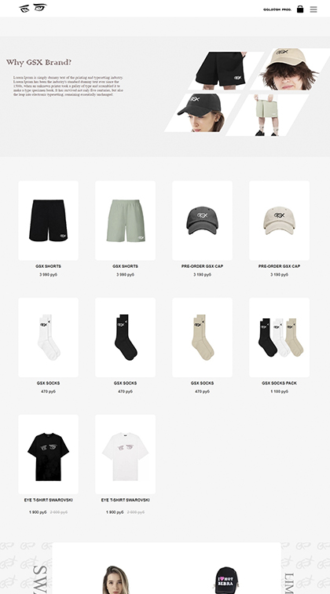
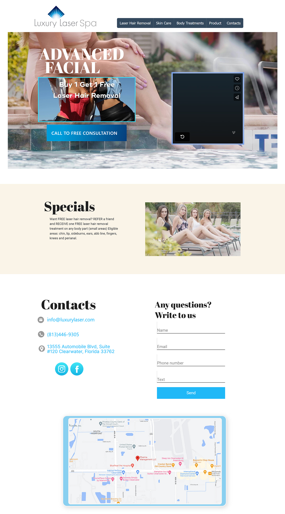
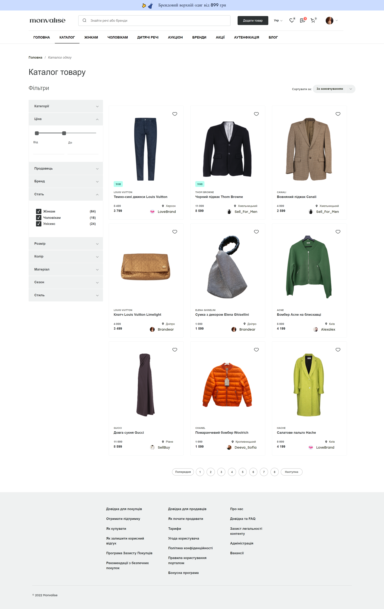

-1.gif)
## Hello🖐, my name is Vladyslav Penkin
#### I`ve been into front-end for a very long time. I had a lot of orders on the freelance platform.

#### You can also find me at codewars:

# Knowledge and skills:

### Languages and Tools:

### Socials:

### Some project from my work:

