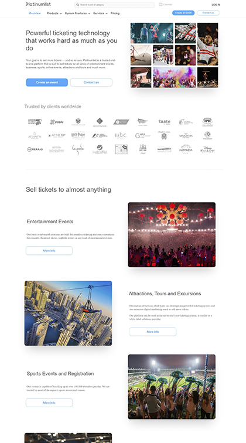

<html>
<head>
<meta charset="UTF-8">
<link rel="stylesheet" href="/readme.css">
</head>
<body style="margin: 10px;">

Knowledge and skills:

Some projects from my work:

Languages and Tools:

Socials:

</body>
</html>